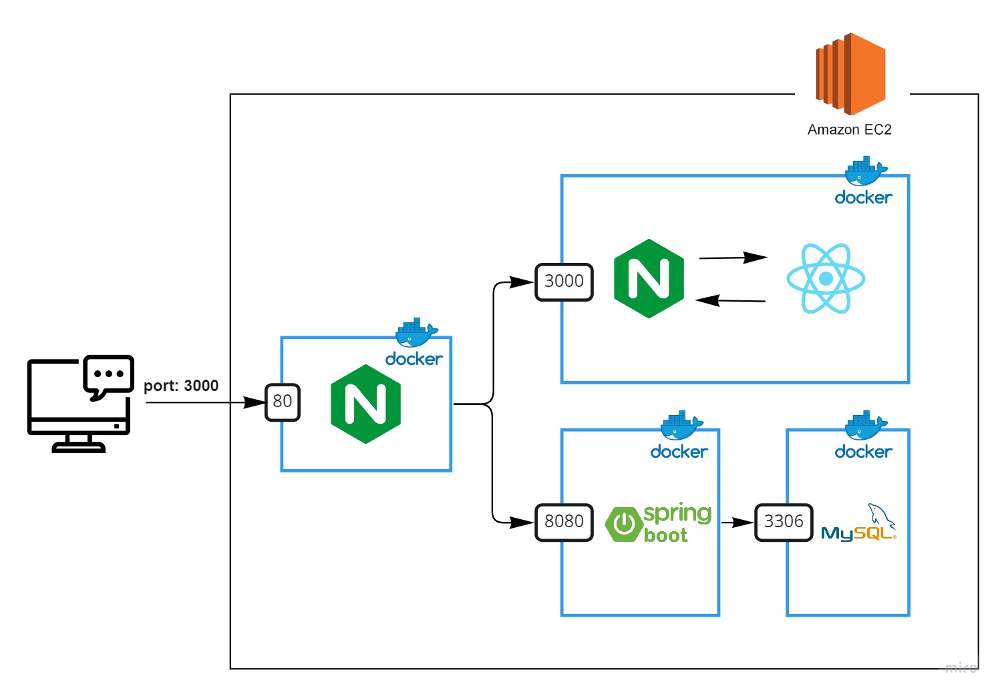
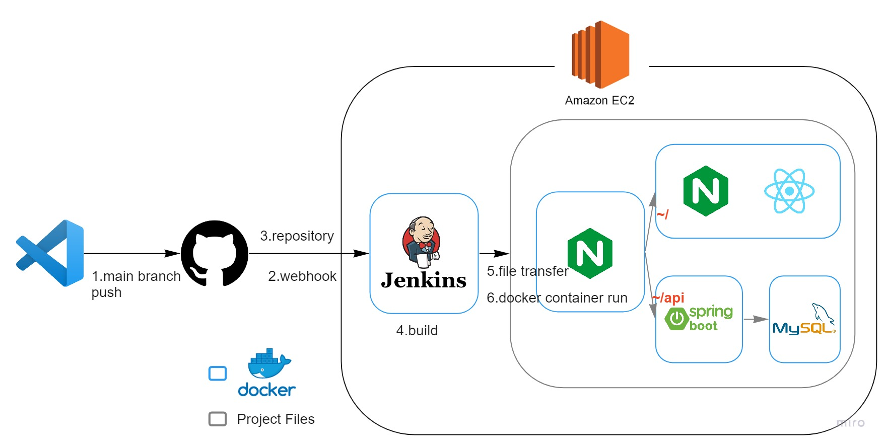

# EC2에 DevOps 환경 구축하기
> AWS EC2에 CI/CD 구축하고 공부해보기 위한 프로젝트

## Stack & Environment
## Execution
## Web Infrastructure

aws ec2 서버에 2개의 nginx, react, spring boot, mysql을 docker-container로 띄워주었다. 
- Nginx를 두개 사용하고 있는데, 앞에 위치한 Nginx는 프록시 서버이다.
  - 요청 URL에 api가 붙으면 Backend로, 그렇지 않으면 Frontend로 요청을 전달해주도록 만들었다.
- Frontend 컨테이너 내부에 있는 Nginx는 정적 파일을 응답해주는 웹 서버의 역할을 한다.
- 2개의 nginx와 react, spring boot는 Dockerfile을 작성하여 이미지를 생성해주어 실행시켰고, Mysql은 도커 허브에 올려진 이미지를 사용하였다. 
- 멀티 도커 컨테이너를 간편하게 구성하기 위해 Docker Compose를 사용하였다.

## CI/CD Flow

1. 로컬에서 코드를 작성한 후 main 브랜치에 push
2. jenkins에 webhook이 날아가고 
3. jenkins 서버에서 git으로부터 repository를 가지고 온다.
4. jenkins에서 spring boot를 빌드해준 후 (react의 경우 도커 이미지 생성 시 빌드해주도록 구성하였기 때문에 spring boot만 해주었다)
5. 빌드가 완료되면 jenkins container에 있는 실행 파일 및 디렉토리를 SSH를 통해 ec2 서버로 전송한 후
6. 도커 컨테이너를 실행시켜 배포를 완료한다.
